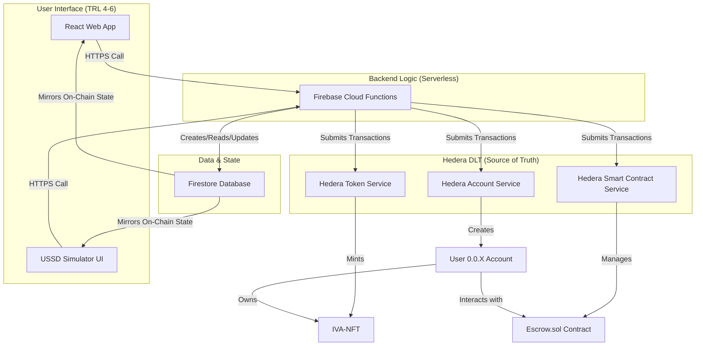

🪙 Project Integro
Project Track: DLT for Operations
This is the main repository for the Integro Ecosystem, our TRL 4-6 (Working Prototype) submission for the Hedera Africa Hackathon.
Key Project Links
* Live Web App (TRL 4-6 Demo): https://integro-hed.netlify.app
* Demo Video (Required): https://youtu.be/g0xtMrfzN9U?si=MeBhpT89FnLRyC3m
* Pitch Deck (Required): https://docs.google.com/presentation/d/1odNrYgbW6caQov2oztkxDawTvbzmURmCN2XT4r5bkGI/edit?usp=drivesdk
* Hedera Certification (Required): View Certification - https://i.postimg.cc/BbJYZ1j9/205e97fd-e799-4d51-a82f-c0b09a53aa4d-1.png (image link as certification link was not found)
(Note: As per submission guidelines, the account Hackathon@hashgraph-association.com has been invited as a collaborator and has accepted the invite.)
1. Our Vision: Integrity & Growth
Our mission is to integrate Africa's fragmented, $3 trillion informal economy into a single, whole ecosystem. We do this by fostering two things:
* Integrity: We build trust through a decentralized "Trust Engine".
* Growth: We unlock economic potential via our three ecosystem arms: a Marketplace, a Finance (Lending) pool, and a Logistics market.
2. The Problem We Solve
The informal economy is trapped by two barriers:
* The "Integrity Gap": A chronic lack of trust. There is no verifiable identity, no proof of asset quality, and no secure payment settlement.
* The "Digital Divide": Most "solutions" ignore the 85% of users on feature phones. This creates a $330B+ annual financing gap and locks them out of the global economy.
3. The Full Ecosystem: Feature Recap
This is the complete vision for Integro.
Foundational Layers (The "Trust Engine")
These two layers work together to power the entire ecosystem.
* Accessibility Foundation (The USSD/SMS Bridge):
* Core Function: Onboards users without smartphones or constant internet.
* Features (Our Vision): Users can create a PIN-secured wallet, list goods, receive real-time SMS notifications for sales and gigs, and search the marketplace, all via simple text menus.
* Trust Engine Foundation (The "Guarantee"):
* Core Function: Eliminates fraud and builds verifiable reputation.
* Features:
* Smart Contract Escrow (TRL-6): Our Escrow.sol contract guarantees payment is locked until delivery is confirmed.
* Agent/Rider Staking (TRL-1 Vision): A "skin in the game" system where agents and riders stake HBAR. If they commit fraud, their stake is "slashed".
* Verifiable Work Log (TRL-1 Vision): Every completed transaction is permanently recorded on the Hedera Consensus Service (HCS), creating an un-fakeable, public resume.
* Soulbound NFT Credentials (TRL-1 Vision): Non-transferable NFTs are awarded for milestones (e.g., "10 Successful Deliveries") to create verifiable, on-chain credentials.
The Three Arms of the Ecosystem
These are the three main applications that run on top of our foundation.
* Marketplace Arm (Goods & Services) (TRL-6):
* Core Function: A unified hub for all commerce.
* Features: We support Tokenized Real-World Assets (RWAs) (a farmer's "100kg Yams" as a unique Hedera NFT) and a Gig Economy marketplace for freelancers and artisans.
* Finance Arm (The "Bank") (TRL-1 Vision):
* Core Function: A peer-to-peer suite of financial tools for the unbanked, supported by other users.
* Features (Our Vision): "Harvest Now, Get Paid Now" (RWA Futures), a Lending Pool (collateralize RWAs or reputation for micro-loans), and Automated Parametric Insurance.
* Logistics Arm (The "Web3-DHL") (TRL-1 Vision):
* Core Function: A decentralized, on-demand delivery network.
* Features (Our Vision): Automated "Delivery Gig" creation, and on-chain supply chain tracking via HCS.
4. Our Hackathon TRL: Prototype vs. Vision
We are 100% transparent about our TRL (Technology Readiness Level).
✅ TRL 4-6 (Working Prototype): The "Golden Path"
This is the core TRL-6 loop that is 100% functional, deployed, and demoed in our video.
* Backend "Account Factory" (createAccount): Our backend createAccount function works. It successfully creates new, non-custodial Hedera accounts (as seen in our demo).
* Backend "Minting" Function (mintRWAviaUSSD): Our backend mintRWAviaUSSD function works. It successfully mints our RWA-NFT (0.0.7134449) to a user's account (demoed at 0:34).
* Frontend Marketplace UI: Our React app (integro-hed.netlify.app) works. It successfully fetches and displays the newly minted NFTs.
* Frontend Escrow Logic: Our handleBuyNow and handleConfirmDelivery functions work. They successfully call our deployed Escrow.sol contract (0.0.7182623) to settle a multi-user trade.
* On-Chain Proof: Our demo video includes live HashScan verification of the final, successful NFT transfer. 
A Note on Execution: This TRL-6 prototype was built from scratch in under 4 weeks by a solo developer (who joined the hackathon in October). The pivots and demo are proof of rapid, real-time development, not a lack of polish.
💡 TRL 1-3 (Vision & Roadmap)
This is our "Ask". These are features we have designed and, in some cases, built the backend for.
* The USSD Simulator UI: We successfully built the backend functions for the USSD bridge (createAccount, mintRWAviaUSSD, setUserProfile, executeNativeNftTransfer), but we ran out of time to build a stable, stateful UI simulator for the demo. Our backend is TRL-4 and ready for a telco partnership.
* Agent/Rider Staking: The UI pages are built, but the staking/slashing smart contract is not.
* The Lending Pool: The UI page is built, but the full lending protocol is not.
* AI Analytics: We will add AI-driven risk scoring to our Lending Pool to determine creditworthiness.
5. Our Technical Architecture

🔐 A Note on Private Keys (Our Non-Custodial Design)
Our createAccount function returns a newly generated private key to the client-side. This is a deliberate and critical architectural choice for this hackathon prototype.
* The Goal: Our project is demonstrating a true, non-custodial "seedless wallet" flow. We empower the user ("Tunde" or "Damola") to have full ownership of their account.
* The "Simulator" Trade-off: For a user to sign their own transactions (like handleBuyNow), their client must have their private key. In this React prototype, the React state acts as a simulation of a mobile device's Secure Enclave.
* Production vs. Prototype: In a production-grade mobile app, this private key would be stored immediately in the native, encrypted keychain. Our prototype proves this non-custodial architecture is 100% viable with Hedera.
Hedera Integration Summary
Our project is a 100% Hedera-Native stack, built after a strategic pivot away from unstable EVM-abstraction tools.
* Hedera Account Service (HAS): This is the core of our "Account Factory." Our backend createAccount function programmatically creates new, non-custodial, ECDSA-based accounts, enabling our "seedless wallet" flow.
* Hedera Token Service (HTS): We use HTS to mint our IVA-NFTs (0.0.7134449). Our secure backend mintRWAviaUSSD function handles this, proving our RWA model. The frontend also interacts with HTS for approvals (AccountAllowanceApproveTransaction).
* Hedera Smart Contract Service (HSCS): We use HSCS for our trustless Escrow.sol contract (0.0.7182623). Our frontend React app calls ContractExecuteTransaction to run the fundEscrow and confirmDelivery functions, proving a true, non-custodial, multi-user trade.
Economic Justification
Our micro-transaction business model is only viable on Hedera. The platform's low, predictable fees (fractions of a cent for our entire "Golden Path") are essential for the informal economy. Its aBFT finality is critical for financial trust.
6. How to Run This Project
Prerequisites
* Node.js (v18 or higher)
* npm
* Firebase CLI (npm install -g firebase-tools)
1. Clone the Repository
git clone https://github.com/TreyKys/Integro-Ecosystem-
cd Integro-Ecosystem-

2. Install Dependencies
npm install
npm install --prefix functions

3. Configure Environment Variables
You will need to create two .env files.
A. React App (/.env.local)
This file configures the frontend.
VITE_FIREBASE_API_KEY="your_firebase_api_key"
VITE_FIREBASE_AUTH_DOMAIN="your_firebase_auth_domain"
VITE_FIREBASE_PROJECT_ID="your_firebase_project_id"
VITE_FIREBASE_STORAGE_BUCKET="your_firebase_storage_bucket"
VITE_FIREBASE_MESSAGING_SENDER_ID="your_firebase_messaging_sender_id"
VITE_FIREBASE_APP_ID="your_firebase_app_id"

B. Firebase Functions (/functions/.env)
This file contains the secrets for the backend.

4. Run the React App Locally
This command starts the Vite development server.
npm run dev

The application will be available at http://localhost:5173.
5. Deploy the Firebase Functions
To use the full functionality (Account Creation, Minting), you must deploy the backend.
# Log in to your Firebase account
npx firebase login

# Select the Firebase project you want to use
npx firebase use

# Deploy only the functions
npx firebase deploy --only functions

7. Deployed IDs & Function URLs
All contracts and tokens are deployed on the Hedera Testnet.
* IVA-NFT Token ID: 0.0.7134449
* Escrow Contract ID: 0.0.7182623
* Firebase Function URLs: (Note: These URLs are specific to your project's deployment)
* createAccount: https://us-central1-integro-ecosystem.cloudfunctions.net/createAccount
* mintRWAviaUSSD: https://us-central1-integro-ecosystem.cloudfunctions.net/mintRWAviaUSSD
* executeNativeNftTransfer: https://us-central1-integro-ecosystem.cloudfunctions.net/executeNativeNftTransfer
* setUserProfile: https://us-central1-integro-ecosystem.cloudfunctions.net/setUserProfile
