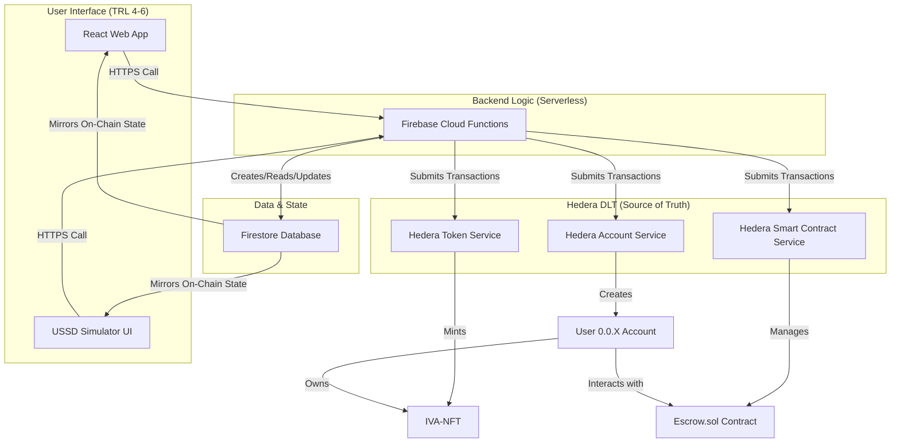

🪙 Project Integro
Project Track: DLT for Operations
This is the main repository for the Integro Ecosystem, our TRL 4-6 (Working Prototype) submission for the Hedera Africa Hackathon.
Key Project Links
 * Live Web App (TRL 4-6 Demo): https://integro-hed.netlify.app
 * Demo Video (Required): [https://youtube.com/shorts/uRq0YBxHz3c?si=EzFi-5K9EeIgQ6Xj]
 * Pitch Deck (Required): [https://docs.google.com/presentation/d/1odNrYgbW6caQov2oztkxDawTvbzmURmCN2XT4r5bkGI/edit?usp=drivesdk]
 * Hedera Certification (Required): View our On-Chain Certification NFT - https://i.postimg.cc/BbJYZ1j9/205e97fd-e799-4d51-a82f-c0b09a53aa4d-1.png
(Note: As per submission guidelines, the account Hackathon@hashgraph-association.com has been invited as a collaborator to this repository.)
1. Our Vision: Integrity & Growth
Our mission is to integrate Africa's fragmented, $3 trillion informal economy into a single, whole ecosystem. We do this by fostering two things:
 * Integrity: We build trust through a decentralized "Trust Engine" (Identity, Reputation, Escrow).
 * Growth: We unlock economic potential via our three ecosystem arms: a Marketplace, a Finance (Lending) pool, and a Logistics market.
2. The Problem We Solve
The informal economy is trapped by two barriers:
 * The "Integrity Gap": A chronic lack of trust. There is no verifiable identity, no proof of asset quality, and no secure payment settlement.
 * The "Digital Divide": Most "solutions" ignore the 85% of users on feature phones. This creates a $330B+ annual financing gap and locks them out of the global economy.
3. Our Solution & Technology Readiness Level (TRL)
Our solution is the multi-pillar Integro Ecosystem. We are 100% honest about our TRL status:
TRL 4-6 (Working Prototype)
 * The Marketplace "Golden Path": The core of our project is 100% functional. Our main web app (https://integro-hed.netlify.app) demonstrates the entire TRL-6 "Golden Path":
   * Live, on-chain Account Creation (our "Account Factory").
   * Live, on-chain RWA-NFT Minting (our mintRWAviaUSSD function).
   * Live, on-chain Asset Listing (our listAsset escrow function).
   * Live, on-chain Asset Purchase (our fundEscrow function).
   * Live, on-chain Settlement (our confirmDelivery function).
TRL 1-3 (Ideation / Roadmap)
 * Finance Arm: The Lending Pool is our immediate next step. The architecture is designed, but the smart contracts are not yet deployed.
 * Logistics Arm: The Agent Staking and logistics tracking contracts are part of our Phase 3 roadmap.
4. The USSD Simulator: Vision vs. Reality
Our "killer feature" is making Integro accessible to feature phone users via a USSD/SMS bridge.
Our Vision for USSD
Our backend is already built to support this. We have a full suite of USSD-ready Firebase functions (like createVault_ussd, mintRWAviaUSSD, listAsset_ussd, fundEscrow_ussd, confirmDelivery_ussd) that allow a user to perform the entire Golden Path without a web app.
Why It's Not in the Demo
We were 100% committed to demoing a fully stateful, multi-step, multi-user simulator. We successfully built the backend functions, but ran into major, time-consuming UI state-management bugs in the React frontend.
Rather than demo a broken or "stuck" feature, we are presenting our 100% stable TRL-6 web app. Our backend is architecturally ready for a partnership with a telco or USSD gateway.
5. Our Technical Architecture
Why Our "Account Factory" is Built for USSD
Our createVault_ussd function is the key to our accessibility. It's a non-custodial "seedless wallet" flow.

🔐 A Note on Private Keys (Our Non-Custodial Design)
You will notice that our createVault_ussd function returns a newly generated private key to the client-side. This is a deliberate and critical architectural choice for this hackathon prototype.
 * The Goal: Our project is demonstrating a true, non-custodial "seedless wallet" flow. We empower the user ("Tunde" or "Damola") to have full ownership of their account.
 * The "Simulator" Trade-off: For a user to sign their own transactions (like fundEscrow_ussd or confirmDelivery_ussd), their client must have access to their private key. In this React prototype, the React state acts as a simulation of a mobile device's Secure Enclave.
 * Production vs. Prototype: In a production-grade mobile app, this private key would be stored immediately in the native, encrypted keychain. Our prototype proves this non-custodial architecture is 100% viable with Hedera.
Hedera Integration Summary
*   **Hedera Account Service (HAS):** We chose HAS for its ability to programmatically and instantly create new, fully-funded user accounts. This powers our `createAccount` function, the cornerstone of our non-custodial "seedless wallet" architecture. By generating an ECDSA keypair, we ensure every user has true ownership and EVM-compatibility from the moment they join, without needing a pre-existing wallet or complex onboarding.

*   **Hedera Token Service (HTS):** We chose HTS to represent Real World Assets (RWAs) as unique, traceable Integro Verified Asset NFTs (IVA-NFTs). Its native performance and low minting costs are critical for our high-volume model. Our secure, backend `mintRWAviaUSSD` function uses an admin-held supply key, allowing us to maintain control over asset verification while still minting the NFT directly into the user's account, separating asset issuance from ownership.

*   **Hedera Smart Contract Service (HSCS):** We chose HSCS to build our trustless "Golden Path" for commerce. Our `Escrow.sol` contract (ID: 0.0.7152729) is the impartial intermediary that guarantees atomic settlement. Functions like `fundEscrow` and `confirmDelivery` leverage HSCS to lock HBAR and NFTs, ensuring that sellers are paid if and only if buyers confirm receipt, eliminating counterparty risk. The `Controller.sol` pattern adds a layer of security, allowing only our trusted backend to release funds.
Economic Justification
Our micro-transaction business model is only viable on Hedera. The platform's low, predictable fees are essential for a high-volume, low-margin market like the informal economy. Its aBFT finality is critical for building financial trust.
6. Our Ecosystem & Tokenomics
Integro is more than a marketplace. We support goods, services, and impact-driven jobs/gigs. This is powered by a dual-token ecosystem:
 * Integro Verified Asset (IVA-NFT) (ACTIVE):
   * Class: RWA-NFT (on HTS).
   * Token ID: 0.0.7134449.
   * Utility: A 1:1 digital twin for a real-world asset (e.g., "1 serial = 50kg of Yams"). This is the transferable asset we trade.
 * Integro Reputation ID (SBT) (FUTURE):
   * Class: Soulbound NFT (Non-Transferable).
   * Utility: A permanent, on-chain reputation for each user.
   * Engine: This SBT will be built using immutable logs from the Hedera Consensus Service (HCS). A good reputation (e.g., 50 successful deliveries) will unlock access to our Lending Pool.
7. How to Run This Project
### Prerequisites
* Node.js (v18 or higher)
* `npm`
* Firebase CLI (`npm install -g firebase-tools`)

### 1. Clone the Repository
```bash
git clone https://github.com/Hashgraph-Association/DLT-Operations-Track-Submission-Integro.git
cd DLT-Operations-Track-Submission-Integro
```

### 2. Install Dependencies
This project contains three separate `npm` packages. You must install dependencies for each one from the project root.
```bash
npm install --prefix skillswap-react
npm install --prefix skillswap-contracts
npm install --prefix functions
```

### 3. Configure Environment Variables
You will need to create two `.env` files to run the full stack.

**A. Firebase Functions (`/functions/.env`)**
This file contains the secrets for the backend functions to interact with Hedera.
```
# The admin account used for paying for transactions and holding the NFT supply key.
HEDERA_ADMIN_ACCOUNT_ID="0.0.6928410"
# The private key for the admin account.
HEDERA_ADMIN_PRIVATE_KEY="your_admin_private_key_here"
# The supply key for the IVA-NFT token.
HEDERA_ADMIN_SUPPLY_KEY="your_admin_supply_key_here"
```

**B. Smart Contracts (`/skillswap-contracts/.env`)**
This file is required for deploying or running tests against the smart contracts.
```
# The private key (without 0x prefix) of the account deploying the contracts.
PRIVATE_KEY="your_deployer_private_key_here"
# A test seller account private key for running tests.
SELLER_PRIVATE_KEY="a_test_seller_private_key_here"
# A test buyer account private key for running tests.
BUYER_PRIVATE_KEY="a_test_buyer_private_key_here"
```

### 4. Run the React App Locally
This command starts the Vite development server for the main web application.
```bash
npm run dev --prefix skillswap-react
```
The application will be available at `http://localhost:5173`.

### 5. Deploy the Firebase Functions
To use the full functionality, you must deploy the backend.
```bash
# Log in to your Firebase account
npx firebase login

# Select the Firebase project you want to use
npx firebase use <your-firebase-project-id>

# Deploy only the functions
npx firebase deploy --only functions
```

Deployed Contract & Token IDs
All contracts and tokens are deployed on the Hedera Testnet.

*   **IVA-NFT Token ID:** `0.0.7134449`
*   **Escrow Contract ID:** `0.0.7152729`
*   **Firebase Function URLs:** (Note: These URLs are specific to your Firebase project deployment.)
    *   `createAccount`: `https://<region>-<project-id>.cloudfunctions.net/createAccount`
    *   `mintRWAviaUSSD`: `https://<region>-<project-id>.cloudfunctions.net/mintRWAviaUSSD`
    *   `listProductFromUSSD`: `https://<region>-<project-id>.cloudfunctions.net/listProductFromUSSD`
    *   `fundEscrowFromUSSD`: `https://<region>-<project-id>.cloudfunctions.net/fundEscrowFromUSSD`
    *   `confirmDeliveryFromUSSD`: `https://<region>-<project-id>.cloudfunctions.net/confirmDeliveryFromUSSD`
    *   `releaseEscrowFunds`: `https://<region>-<project-id>.cloudfunctions.net/releaseEscrowFunds`
    *   `setUserProfile`: `https://<region>-<project-id>.cloudfunctions.net/setUserProfile`

8. Our Roadmap (What's Next)
 * Phase 1 (Complete): TRL-6 "Marketplace" Prototype.
 * Phase 2 (Next): Build the Finance Arm. Deploy the "Lending Pool" smart contracts.
 * Phase 3 (Future): Implement the HCS + SBT "Reputation Engine" and the Agent Staking contracts.
 * Phase 4 (Future): Scale the Logistics arm and onboard the first telco partners for the USSD bridge.
